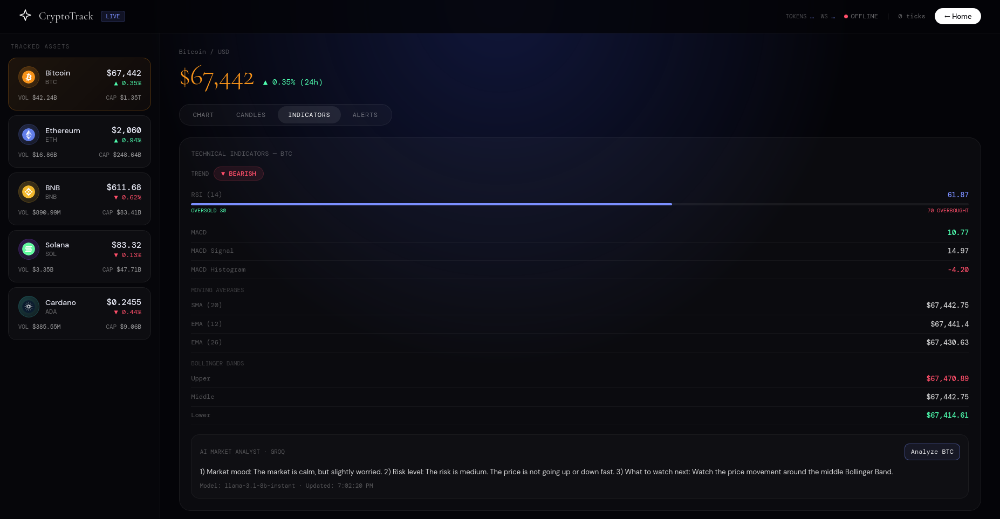

# CryptoTracker


A full-stack real-time cryptocurrency analytics dashboard. Fetches live prices from CoinGecko, streams them through Kafka, persists to MongoDB, and delivers live updates to a React frontend via SSE and WebSocket.

---

## Demo

**Home Page** — Animated landing page with live floating asset prices.


**Live Chart** — Real-time price chart streamed via Kafka → SSE → React, with market cap and volume stats.


**OHLCV Candles** — Candlestick chart with 1m / 5m / 1h intervals aggregated from Kafka ticks.


**Technical Indicators** — RSI, MACD, Bollinger Bands, SMA, and EMA with trend signal.


**AI Market Analyst** — Sends live price + RSI/MACD/Bollinger snapshot to Groq and returns a natural language market summary.

**AI Price Alert Explainer** — When an alert triggers, Groq function-calling is used to fetch indicator context and explain in plain language why price likely moved.

**Price Alerts** — Create and manage real-time price alerts with live SSE-based trigger notifications.


---

## Architecture

```
CoinGecko → Scheduler → Kafka Producer → [crypto-prices] → Kafka Consumer
                                                                  ├── MongoDB (ticks, candles, alerts)
                                                                  ├── Alert Service
                                                                  ├── SSE /api/prices/stream
                                                                  ├── SSE /api/alerts/stream
                                                                  └── WebSocket /ws/prices
                                                                        ↓
                                                                  React Dashboard
```

---

## Getting Started

### Docker (Recommended)

```bash
export GROQ_API_KEY=your_groq_api_key
docker compose up --build
```

| Service   | URL                      |
|-----------|--------------------------|
| Frontend  | http://localhost:3000    |
| Backend   | http://localhost:8080    |
| Kafka     | localhost:9092           |
| MongoDB   | localhost:27017          |

```bash
docker compose down        # stop
docker compose down -v     # stop + remove volumes
```

### Local

```bash
# 1. Start MongoDB, Kafka, Zookeeper locally

# 2. Backend
export GROQ_API_KEY=your_groq_api_key
cd backend && mvn spring-boot:run

# 3. Frontend
cd frontend && npm install && npm start
```

---

## API Reference

| Method | Endpoint | Description |
|--------|----------|-------------|
| GET | `/api/prices/latest` | Latest tick for all symbols |
| GET | `/api/prices/history/{symbol}?hours=24` | Historical price ticks |
| GET | `/api/candles/{symbol}?interval=1h&limit=100` | OHLCV candles (`1m`, `5m`, `1h`) |
| GET | `/api/indicators/{symbol}` | RSI, MACD, Bollinger Bands, MAs |
| GET | `/api/ai/market-summary/{symbol}` | AI natural language summary via Groq |
| GET | `/api/alerts` | List all alerts |
| POST | `/api/alerts` | Create alert `{ symbol, condition, targetPrice }` |
| DELETE | `/api/alerts/{id}` | Delete an alert |

**Streaming:** SSE at `/api/prices/stream` and `/api/alerts/stream` · WebSocket at `ws://localhost:8080/ws/prices`

---

## Tech Stack

**Backend:** Java 17, Spring Boot 3.2, Spring Kafka, Spring Data MongoDB, WebSocket, Maven  
**Frontend:** React 18, Recharts, Nginx  
**Infrastructure:** Apache Kafka, Zookeeper, MongoDB, Docker Compose